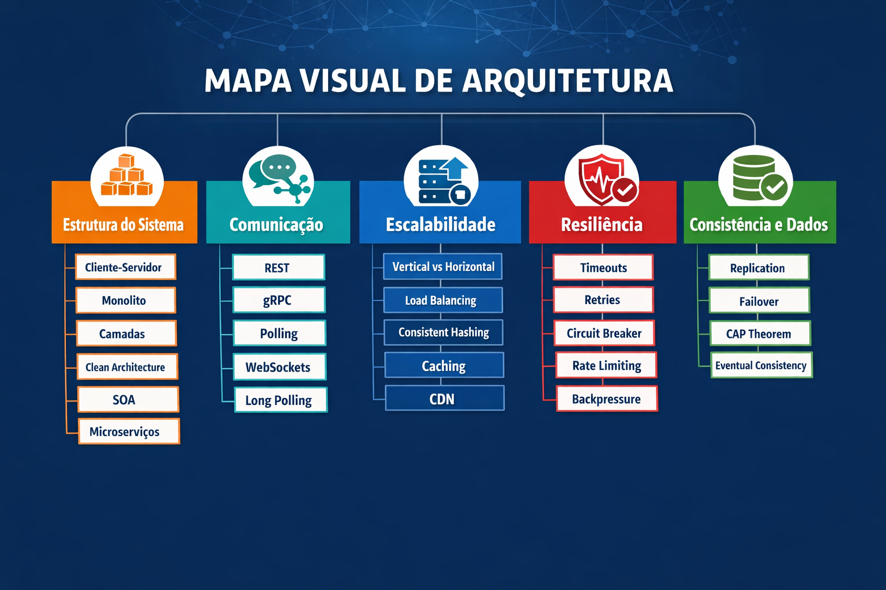

# 🗺 Backend Architecture 

## Roadmap de 12 Semanas --- Sistema Evolutivo Orientado a Problemas

Focado em Arquitetura de Sistemas, Distributed
Systems e System Design.

A proposta é evoluirmos juntos como engenheiros, estudando conceitos
fundamentais, discutindo trade-offs reais e aplicando tudo em código
através de hands-on e code review colaborativo.

------------------------------------------------------------------------

# 🎯 Objetivos

-   Desenvolver maturidade arquitetural
-   Aprender a tomar decisões técnicas conscientes
-   Entender trade-offs de diferentes abordagens
-   Melhorar qualidade de code review
-   Evoluir pensamento crítico em engenharia
-   Treinar System Design na prática

------------------------------------------------------------------------

# 🏗 Como Funciona

## 📅 Estrutura Semanal

Cada semana teremos:

-   📖 Estudo prévio individual
-   🎤 Um grupo responsável pelo tema
-   💻 Hands-on prático
-   🔁 Code Review coletivo
-   🧠 Discussão de trade-offs

O grupo **não é o único responsável pelo aprendizado**.\
Todos devem estudar previamente para contribuir ativamente.

------------------------------------------------------------------------

# 🔁 Fluxo de Trabalho (Git + PR)

1.  O apresentador(es) cria uma branch:

    week-XX-tema

2.  Sobe:

    -   Material em Markdown
    -   Exemplos de código
    -   Exercícios práticos

3.  Abre um Pull Request até 2 dias antes da apresentação

4.  Todos:

    -   Fazem code review
    -   Questionam decisões
    -   Sugerem melhorias
    -   Comentam trade-offs

5.  Durante a apresentação:

    -   Discutimos os comentários
    -   Ajustamos decisões
    -   Consolidamos aprendizado

------------------------------------------------------------------------

# 📁 Estrutura do Repositório
```bash
backend-architecture-guild
│
├── README.md
├── 01-fundamentals
│   ├── monolith
│   ├── layered-architecture
│   └── clean-architecture
│
├── 02-distributed-systems
│   ├── soa
│   ├── microservices
│   ├── rest-vs-grpc
│   └── communication-patterns
│
├── 03-scalability
│   ├── scaling
│   ├── load-balancing
│   ├── caching
│   ├── consistent-hashing
│   ├── replication
│   └── cap-theorem
│
└── 04-system-design
```
------------------------------------------------------------------------

## 🎯 Visão Geral

Este roadmap está prganizado em 12 semanas utilizando:

-   ✅ Modelo orientado a problemas reais
-   ✅ Sistema evolutivo único (Plataforma de Reservas ou E-commerce)
-   ✅ Cobertura equilibrada de todas as dimensões arquiteturais
-   ✅ Implementação prática + PR(Pull-Request) + (Architecture Decision Record) por semana

Arquitetura aqui é tratada como **decisão sob restrição**.




# 📝 Exemplo Pull Request - Semana [N] - [Nome do Case]

## 🔥 Problema
<!-- Descreva brevemente o problema que este PR resolve -->
Exemplo: Latência alta em endpoints críticos durante picos de tráfego.

## 🎯 Objetivos do PR
- Implementar [feature/refatoração]
- Garantir observabilidade mínima (logs/métricas)
- Documentar decisão arquitetural

## 💻 Alterações Realizadas
- [ ] Endpoint `/reservas` otimizado
- [ ] Implementado cache estratégico
- [ ] Logs estruturados adicionados
- [ ] Métricas de latência coletadas

## 📊 Métricas / Observabilidade
| Métrica | Antes | Depois | Observações |
|---------|-------|--------|-------------|
| Latência p95 | 450ms | 120ms | Redução significativa após cache |
| Taxa de erro | 2% | 0.5% | Falha em endpoints críticos mitigada |
| Throughput | 100 req/s | 120 req/s | Ganho leve de performance |

## ⚖ Trade-offs e Decisões Arquiteturais
- Escolha: Cache in-memory vs Cache distribuído
- Motivo: Simplicidade na fase inicial
- Impacto: Consistência eventual, ganho de performance imediato
- Referência ADR: [link para arquivo ADR se aplicável]

## 🧪 Testes Realizados
- [ ] Testes unitários cobrindo 95% do código
- [ ] Testes de integração nos endpoints alterados
- [ ] Testes de carga simulando 50k usuários

## ❓ Pontos para Debate / Feedback
- Alternativa a cache distribuído valeria o esforço nesta fase?
- Melhor abordagem para logs estruturados?
- Como medir impacto real em produção?

## 📎 Referências
- ADR: `docs/adr/adr-[semana]-[case].md`
- Documentação interna: [link]
- Issue relacionada: #[Número da Issue]

---

# Exemplo ADR [Número] - [Título da Decisão]

## Status
Proposed / Accepted / Deprecated

## Contexto
<!-- Explique o problema ou situação que exige uma decisão arquitetural -->
Exemplo: O sistema de reservas precisa responder rapidamente durante picos de acesso, mas não há infraestrutura de cache distribuído ainda.

## Decisão
<!-- Qual foi a decisão tomada -->
Exemplo: Implementar cache in-memory no serviço de reservas para reduzir latência em endpoints críticos.

## Alternativas Consideradas
1. **Cache distribuído** – Maior consistência e escalabilidade, mas complexidade e custo mais altos.
2. **Não usar cache** – Simples, mas alto tempo de resposta sob carga.
3. **Cache in-memory** – Equilíbrio entre simplicidade e ganho de performance imediato.

## Consequências
- **Positivas:** Latência reduzida, implementação rápida, fácil manutenção.
- **Negativas:** Consistência eventual, dados podem ficar desatualizados momentaneamente, não escala horizontal sem ajustes adicionais.

## Métricas / Observabilidade
- Latência p95 antes/depois: 450ms → 120ms
- Taxa de erro: 2% → 0.5%
- Throughput: 100 req/s → 120 req/s

## Referências
- Issue relacionada: #[Número da Issue]
- Documentação interna: [link]
- Pull Request associado: #[Número do PR]
------------------------------------------------------------------------

# 🧠 Sistema Base

Plataforma de Reservas / E-commerce /simplificado com domínios:

-   Usuários
-   Catálogo / Reservas
-   Pagamentos
-   Notificações
-   Relatórios

O sistema começa simples e evolui sob pressão.

------------------------------------------------------------------------

# 📊 Observabilidade (Dimensão Transversal)

Arquitetura sem evidência é opinião.

Desde a Semana 1, todas as decisões deverão ser acompanhadas de métricas e sinais observáveis. O sistema evolui, mas a capacidade de entendê-lo precisa evoluir junto.

Observabilidade não é ferramenta — é capacidade de responder perguntas sobre o sistema em produção.

------------------------------------------------------------------------

## 🎯 Objetivos

- Medir antes de otimizar
- Detectar falhas rapidamente
- Entender comportamento sob carga
- Apoiar decisões arquiteturais com dados

------------------------------------------------------------------------

## 🧱 Pilares

### 📝 Logs
- Logs estruturados (JSON)
- Correlação por request (Correlation ID)
- Separação entre logs técnicos e de negócio
- Níveis adequados (INFO, WARN, ERROR)

Pergunta-chave:
> Conseguimos reconstruir um incidente apenas pelos logs?

------------------------------------------------------------------------

### 📈 Métricas
Coletar desde o início:

- Latência (p50, p95, p99)
- Throughput (req/s)
- Taxa de erro
- Uso de CPU e memória
- Tempo de resposta por endpoint

Conceitos importantes:
- SLI (Service Level Indicator)
- SLO (Service Level Objective)

Pergunta-chave:
> Estamos realmente melhorando ou apenas mudando a arquitetura?

------------------------------------------------------------------------

### 🔍 Tracing (Introdução a partir da Fase 2)

- Rastreamento distribuído
- Identificação de gargalos entre serviços
- Visualização de dependências

Pergunta-chave:
> Onde exatamente está a latência?

------------------------------------------------------------------------

## ⚖ Observabilidade Como Critério de Avaliação

A cada semana, além da implementação, o grupo deverá apresentar:

- Métricas antes/depois da mudança
- Impacto arquitetural mensurável
- Evidências de melhoria (ou regressão)
- O que foi aprendido com os dados

Sem dados, a decisão arquitetural não é válida.

------------------------------------------------------------------------

## 🧠 Evolução ao Longo das Fases

Fase 1 → Logs básicos + métricas simples  
Fase 2 → Métricas de escala e performance  
Fase 3 → Monitoramento de falhas e resiliência  
Fase 4 → Observabilidade distribuída e consistência  

------------------------------------------------------------------------

# 📅 FASE 1 --- FUNDAÇÃO (Semanas 1--3)

Foco: Estrutura + Comunicação

------------------------------------------------------------------------

### 🟢 Semana 1 — MVP Rápido

**Case Real Detalhado:**  
O time de produto precisa lançar rapidamente uma plataforma de reservas em 2 semanas para validar a aceitação do mercado. Temos apenas um monolito simples, CRUD de reservas e usuários, e logs básicos. O time de front-end depende de respostas rápidas para o MVP.

**Dimensões:**  
- Estrutura → Cliente-Servidor, Monolito, Camadas  
- Comunicação → REST  
- Introdução à Clean Architecture  

**Objetivos da Semana:**  
- Criar API mínima viável para reservas e usuários  
- Implementar estrutura em camadas básica  
- Coletar logs e métricas iniciais  

**Questões para Debate:**  
- Vale a pena investir em clean architecture já no MVP?  
- Como equilibrar velocidade de entrega e qualidade de código?  
- Logs e métricas básicas são suficientes para validar decisões?  
- Um monolito simples atende aos objetivos do MVP ou já pensar em modularização?  

---

### 🔵 Semana 2 — Código Virou Caos

**Case Real Detalhado:**  
Após 2 semanas, novas funcionalidades quebram endpoints existentes. Clientes relatam inconsistência nos dados. O time precisa refatorar sem atrasar entregas, mantendo cobertura mínima de testes.

**Dimensões:**  
- Estrutura → Hexagonal / Clean Architecture  
- Modularização  
- Separação de domínio  

**Objetivos:**  
- Refatorar código para modularidade sem bloquear features  
- Separar claramente domínio e infraestrutura  
- Melhorar cobertura de testes e qualidade de código  

**Questões para Debate:**  
- Qual abordagem de modularização traz mais benefícios: hexagonal, DDD, pacotes separados?  
- Refatoração parcial vale o esforço agora ou seguimos evoluindo com código “quebrável”?  
- Como balancear testes automatizados vs. velocidade de entrega?  
- Como definir limites claros de responsabilidade entre módulos?  

---

### 🟣 Semana 3 — Comunicação Mais Eficiente

**Case Real Detalhado:**  
O módulo de pagamentos precisa se comunicar com reservas e usuários. Chamadas REST síncronas geram latência de 1s por requisição, impactando a experiência do usuário. O time precisa explorar alternativas de comunicação.

**Dimensões:**  
- Comunicação → REST vs gRPC  
- Contratos fortes  
- API Design  

**Objetivos:**  
- Comparar REST vs gRPC para comunicação interna  
- Implementar versão de teste com contrato forte  
- Medir impacto de latência e confiabilidade  

**Questões para Debate:**  
- REST é suficiente ou gRPC/WebSockets trariam ganho real?  
- Como versionar APIs sem quebrar clientes internos?  
- Contratos formais são necessários nesta fase ou trazem complexidade desnecessária?  
- Qual impacto no deploy contínuo ao introduzir comunicação assíncrona?  

---

## 📅 FASE 2 — ESCALABILIDADE (Semanas 4–6)

### 🟡 Semana 4 — Sistema Lento com 50k Usuários

**Case Real Detalhado:**  
Uma campanha de marketing trouxe 50k usuários simultâneos. Endpoints `/reservas` e `/pagamentos` respondem lentamente. O time precisa escalar sem alterar funcionalidades, mantendo estabilidade.

**Dimensões:**  
- Escalabilidade → Vertical vs Horizontal  
- Load Balancing  

**Objetivos:**  
- Simular múltiplas instâncias do serviço  
- Testar load balancing básico  
- Medir impacto em latência e throughput  

**Questões para Debate:**  
- Escalabilidade vertical ou horizontal?  
- Load balancing simples é suficiente ou sticky sessions são necessárias?  
- Introduzir cache nesta fase vale o esforço?  
- Impacto no custo de infraestrutura e manutenção?  

---

### 🟠 Semana 5 — Picos de Tráfego (Black Friday)

**Case Real Detalhado:**  
Durante a Black Friday, múltiplos clientes tentam reservar simultaneamente. CPU chega a 80% e latência dispara. Necessário evitar falhas e manter performance mínima.

**Dimensões:**  
- Caching  
- CDN  
- Cache distribuído  

**Objetivos:**  
- Implementar cache estratégico em endpoints críticos  
- Medir redução de latência e taxa de erro  
- Avaliar trade-offs de consistência vs performance  

**Questões para Debate:**  
- Cache distribuído vs local: quando usar cada um?  
- CDN para assets deve ser responsabilidade do backend ou front-end?  
- Como testar impacto do cache sem produção?  
- Estratégia de rollback se cache gerar inconsistência?  

---

### 🔵 Semana 6 — Sistema Stateful em Escala

**Case Real Detalhado:**  
Usuários relatam que sessões e carrinhos desaparecem em múltiplos serviços. Ao escalar horizontalmente, problemas de estado ficam evidentes. O time precisa definir estratégia para sessão distribuída.

**Dimensões:**  
- Consistent Hashing  
- Estratégias para estado distribuído  

**Objetivos:**  
- Resolver problemas de estado distribuído  
- Garantir persistência de sessão/carrinho  
- Comparar estratégias (Redis cluster, JWT stateless, sticky sessions)  

**Questões para Debate:**  
- Estratégias para session stateful vs stateless: prós e contras?  
- Consistent Hashing ou Redis cluster: qual mais eficiente?  
- Impactos de segurança e performance em cada abordagem?  
- Como testar escala horizontal sem afetar usuários reais?  

---

## 📅 FASE 3 — RESILIÊNCIA (Semanas 7–9)

### 🔴 Semana 7 — Serviço Externo Instável

**Case Real Detalhado:**  
O gateway de pagamento falha intermitentemente, causando cancelamentos de reservas. O time precisa proteger o sistema sem degradar UX.

**Dimensões:**  
- Timeouts  
- Retries  
- Circuit Breaker  

**Objetivos:**  
- Implementar proteção contra falhas externas  
- Minimizar impacto no usuário  
- Registrar métricas de falhas e retries  

**Questões para Debate:**  
- Circuit breaker vs retry com backoff exponencial: qual cenário é melhor?  
- Qual timeout máximo é aceitável sem prejudicar experiência do usuário?  
- Como monitorar falhas externas de forma efetiva?  
- Estratégias de fallback: dummy data, retry ou erro imediato?  

---

### 🛡 Semana 8 — Sobrecarga

**Case Real Detalhado:**  
O endpoint `/reservas` recebe mais requisições que pode processar. Algumas falham e outras chegam atrasadas. É preciso proteger endpoints críticos e garantir continuidade.

**Dimensões:**  
- Rate Limiting  
- Bulkhead  
- Backpressure  

**Objetivos:**  
- Aplicar proteção em endpoints críticos  
- Medir impacto na performance e latência  
- Garantir continuidade do serviço para usuários prioritários  

**Questões para Debate:**  
- Rate limiting por usuário vs IP vs endpoint: qual mais justo?  
- Bulkhead: como isolar serviços críticos sem perder flexibilidade?  
- Backpressure: como comunicar ao cliente que o sistema está sobrecarregado?  
- Como medir impacto de limitação no negócio?  

---

### ⚫ Semana 9 — Região Caiu

**Case Real Detalhado:**  
O data center primário ficou indisponível. O sistema precisa continuar funcionando com dados consistentes ou eventual, sem impactar reservas ativas.

**Dimensões:**  
- Failover  
- Replication  

**Objetivos:**  
- Garantir disponibilidade mínima durante falha geográfica  
- Testar failover automático vs manual  
- Avaliar consistência de dados entre regiões  

**Questões para Debate:**  
- Replicação síncrona ou assíncrona?  
- Failover automático vs manual: prós e contras?  
- Como gerenciar consistência de dados em múltiplas regiões?  
- Alertas e monitoramento: quais métricas críticas observar?  

------------------------------------------------------------------------

# 📅 FASE 4 --- CONSISTÊNCIA E TEMPO REAL (Semanas 10--11)

------------------------------------------------------------------------

### 🗄 Semana 10 — Dados Inconsistentes

**Case Real Detalhado:**  
Um usuário realizou o pagamento de uma reserva, mas o sistema não confirmou a reserva imediatamente. Relatórios internos mostram que 5% das transações estão com status divergente entre serviços de pagamento e reservas. O time precisa introduzir consistência eventual sem bloquear todo o sistema.

**Dimensões:**  
- CAP Theorem  
- Eventual Consistency  
- Modelos de atualização assíncrona  

**Objetivos:**  
- Implementar fluxo de processamento eventual para reservas  
- Garantir que inconsistências sejam detectadas e resolvidas automaticamente  
- Medir impacto de latência e consistência nos usuários  

**Questões para Debate:**  
- Eventual consistency vs. transações distribuídas: quando cada uma faz sentido?  
- Estratégias de compensação para erros em pipelines assíncronos  
- Impacto no UX ao usar consistência eventual  
- Como instrumentar métricas para detectar inconsistências rapidamente?  

---

### 🟢 Semana 11 — Notificação em Tempo Real

**Case Real Detalhado:**  
Usuários querem receber confirmação instantânea de reservas e atualizações de status de pagamento. O sistema atual demora até 5 segundos para atualizar front-end e mobile apps. O time precisa implementar notificação em tempo real, garantindo escalabilidade e tolerância a falhas.

**Dimensões:**  
- Polling, Long Polling, WebSockets, gRPC Streaming  
- Latência vs complexidade  
- Observabilidade de entrega em tempo real  

**Objetivos:**  
- Comparar diferentes estratégias de comunicação em tempo real  
- Implementar POC de WebSockets ou gRPC streaming  
- Medir latência e confiabilidade do sistema de notificações  

**Questões para Debate:**  
- Polling, WebSockets ou gRPC Streaming: trade-offs de complexidade e latência  
- Qual abordagem escala melhor para milhares de usuários simultâneos?  
- Impacto de falhas na entrega em tempo real: como mitigar  
- Como monitorar e validar entrega de notificações em produção?  


------------------------------------------------------------------------

# 📅 Semana 12 — System Design Final (Mini Hackathon)

## 🎯 Objetivo
Consolidar todo o aprendizado das semanas anteriores, permitindo que cada grupo:

- Apresente a arquitetura completa do sistema evolutivo (Plataforma de Reservas ou E-commerce)
- Justifique decisões arquiteturais por dimensão
- Defenda trade-offs e escolhas de implementação
- Receba questionamentos técnicos de todos os participantes
- Demonstre métricas, observabilidade e evidências de melhorias

> ⚠️ **Observação:** Nesta semana **não faremos implementação de código**. O foco é **desenho arquitetural**, propostas de soluções e debate técnico entre grupos.

---

## 🧩 Estrutura do Mini Hackathon

| Etapa | Descrição | Tempo Sugerido |
|-------|-----------|----------------|
| 1️⃣ Preparação | Cada grupo revisa seu histórico de PRs, ADRs e métricas coletadas | 15 min |
| 2️⃣ Apresentação | Cada grupo apresenta: <br> - Arquitetura geral em desenho/diagramas <br> - Mudanças implementadas nas semanas anteriores (resumido) <br> - Principais métricas <br> - ADRs associados | 10 min por grupo |
| 3️⃣ Defesa Técnica | Grupo explica decisões por dimensão: <br> - Estrutura <br> - Comunicação <br> - Escalabilidade <br> - Resiliência <br> - Consistência | 10 min por grupo |
| 4️⃣ Debate Coletivo | Observadores questionam escolhas, sugerem alternativas, discutem trade-offs | 15 min por grupo |
| 5️⃣ Conclusão | Cada grupo registra lições aprendidas e insights estratégicos | 10 min |

---

## 🏗 Dimensões de Avaliação

### 1️⃣ Estrutura
- Monolito, Camadas, Hexagonal, Microservices, SOA
- Modularização e separação de domínio
- Trade-offs: simplicidade vs complexidade, facilidade de manutenção

### 2️⃣ Comunicação
- REST vs gRPC vs WebSockets vs Polling
- Contratos fortes e versionamento
- Trade-offs: latência vs consistência vs complexidade

### 3️⃣ Escalabilidade
- Vertical vs Horizontal
- Load Balancing, Replication, Consistent Hashing
- Trade-offs: custo vs performance vs complexidade operacional

### 4️⃣ Resiliência
- Circuit Breaker, Retries, Bulkhead, Backpressure, Rate Limiting
- Failover e tolerância a falhas
- Trade-offs: disponibilidade vs consistência vs complexidade

### 5️⃣ Consistência / Tempo Real
- CAP Theorem, Eventual Consistency
- Modelos de atualização e notificação (WebSockets / Streaming / Polling)
- Trade-offs: latência vs consistência vs simplicidade

---

## 📊 Métricas e Observabilidade

Cada grupo deve apresentar **evidências quantitativas e qualitativas** das mudanças anteriores, mesmo que não implementadas nesta semana:

| Métrica | Antes | Depois | Observações |
|---------|-------|--------|-------------|
| Latência p50/p95/p99 |  |  |  |
| Throughput (req/s) |  |  |  |
| Taxa de erro (%) |  |  |  |
| Uso de CPU / Memória |  |  |  |
| Tempo de resposta por endpoint |  |  |  |

💡 **Dica:** Vincule métricas à decisão arquitetural e ao desenho do sistema.

---

## 📝 Entregáveis por Grupo

1. **Arquitetura completa em desenho/diagramas** (diagrama de componentes, fluxos, integrações)  
2. **Resumo de Pull Requests relevantes** das semanas anteriores  
3. **ADRs resumindo decisões críticas**  
4. **Métricas e evidências de melhoria**  
5. **Registro do debate e lições aprendidas**

---

## ⚡ Pontos de Debate Sugeridos

- Alternativas de arquitetura não adotadas valem o esforço?  
- Trade-offs foram bem justificados?  
- Há inconsistências ou problemas de performance não tratados?  
- Observabilidade está suficiente para validar decisões?  
- O sistema proposto se adapta a crescimento futuro?

---

## 🏁 Resultado Esperado

Ao final do Mini Hackathon:

- Cada participante compreende as **decisões arquiteturais de ponta a ponta**
- Todos conseguem **defender trade-offs** com base em evidências
- O grupo como um todo tem visão de **um sistema distribuído completo**  
- Observabilidade e métricas continuam sendo critério central de decisão
- Aprendizado coletivo através do debate arquitetural e revisão de propostas

---

💡 **Resumo:** Semana 12 transforma o aprendizado teórico e prático das 11 semanas anteriores em um **laboratório de decisões arquiteturais**, focado em **desenho, debate e análise de soluções**, sem codificação.

------------------------------------------------------------------------

# 🏁 Resultado Esperado

Ao final das 12 semanas, o grupo terá experimentado:

-   Cliente-Servidor
-   Monolito
-   Camadas
-   Hexagonal
-   SOA (conceitualmente na evolução)
-   Microservices
-   REST
-   gRPC
-   Polling / WebSockets
-   Vertical e Horizontal Scaling
-   Load Balancing
-   Consistent Hashing
-   Caching
-   CDN
-   Replication
-   Failover
-   CAP Theorem
-   Eventual Consistency
-   Padrões de Fault Tolerance

------------------------------------------------------------------------

# 🎯 Objetivo Final

Formar engenheiros capazes de:

-   Tomar decisões arquiteturais conscientes
-   Defender trade-offs
-   Pensar em múltiplas dimensões simultaneamente
-   Projetar sistemas distribuídos reais

Arquitetura é equilíbrio entre forças.
